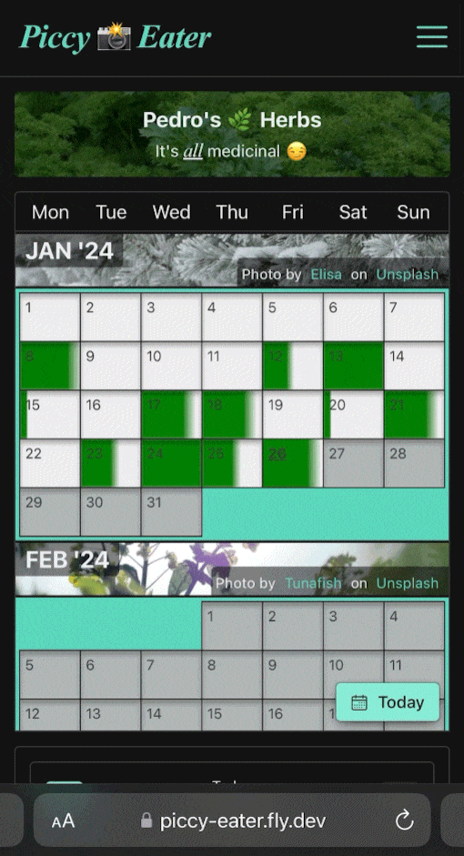
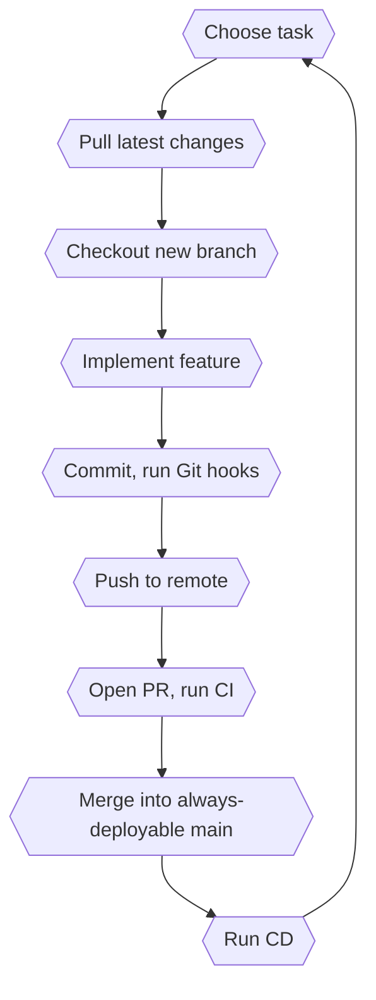

# PiccyEater Diet Accountability App

> App that lets users record and rate their meals each day to help them stick to a diet.

[🚀 TRY THE APP LIVE](https://piccy-eater.fly.dev/) **_Note:_** It's fine to use dummy data to sign in (it isn't used beyond authenticating users).

  

## Table Of Contents

Expand Contents

- [About This Project](#about-this-project)
  - [What It Does](#what-it-does)
  - [How To Use It](#how-to-use-it)
  - [How I Approached It](#how-i-approached-it)
  - [Code Samples](#code-samples)
- [Technical Details](#technical-details)
  - [Architecture](#architecture)
  - [Tools & Technologies](#tools-technologies)
  - [Toolkit Decisions](#toolkit-decisions)
  - [Git & GitHub](#git-github)
  - [Security](#security)
  - [Code Quality & Best Practices](#code-quality-best-practices)
  - [Design & UI/UX](#design-ui-ux)
  - [Authentication & Authorization](#authentication-authorization)
  - [Testing](#testing)
  - [Use Of AI](#use-of-ai)
- [Thoughts & Musings](#thoughts-musings)
  - [What I Learned](#what-i-learned)
  - [Challenges I Faced](#challenges-i-faced)
  - [What I Would Change](#what-i-would-change)
  - [Overall Thoughts](#overall-thoughts)
- [Acknowledgements](#acknowledgements)

## ℹ️ About This Project 

I wanted to challenge myself by creating a non-trivial, full-stack project, from design to deployment, with a professional Git flow. I knew this would teach me more than multiple smaller projects because it requires more systems-level, architectural thinking as you work across different layers and domains.

### ❓ What It Does: 

- Friend wanted an app which kept track of what they were eating, but less strict than a calorie counter.
- User records basic information for each meal including a rating for healthiness, and at a glance you can see the daily average for all meals in a calendar.
- Further details can be seen in data visualizations.

### 📖 How To Use It: 

1. Sign up
2. Click on a day in the calendar
3. Choose mealtime and complete form
4. Daily meal rating averages are understood via a visual gradient on each date.
5. Statistics page presents data in various charts
6. FAQs page subverted into much less useful Rarely Asked Questions

### 🛣️ How I Approached It: 

- Talked with friend about what they wanted.
- Sketched wireframes, then full designs (faster iterations than using Figma, for me)
- Modelled data for database, thinking about data flow throughout app while referencing designs, ensuring everything (as far as possible) was accounted for.
- Started coding. Spent large amount of time planning the project before writing any code. Led to more coherent structure, quicker development, more consistent design, less frustration.
- Often stepped away from laptop and thought about problem from a broader - and end user's - perspective.
- I decided not to use any tutorials (rarely do, anyway) and all ideas and implementations are my own. The struggling is the learning.

### 📋 Code Samples: 

- [GraphQL schema](/apps/server/src/schema.graphql)
- [React component](/apps/client/src/components/layout/SignInForm/SignInForm.tsx)
- [Auth in client](/apps/client/src/contexts/AuthContext.tsx)
- [Styled components](/apps/client/src/components/layout/Drawer/Drawer.styled.tsx)
- [Unit tests for util](/apps/client/tests/unit/utils/capitalize-first-letter.test.ts), [custom hook](/apps/client/tests/unit/hooks/useMediaQuery.test.ts), [component](/apps/client/src/pages/CalendarPage/CalendarPage.test.tsx)
- [Integration tests for API](/apps/server/tests/integration/meal.test.ts)
- [Dockerfile](/Dockerfile.prod), [Docker Compose](/docker-compose.yml)
- [GitHub Actions workflow](/.github/workflows/ci.yml)
- [Custom Eslint config](/apps/client/.eslintrc.cjs)
- [Descriptive Pull Request](https://github.com/Thomas-J-A/diet-accountability-app/pull/81)
- [Liberal use of comments](/apps/server/src/services/day-event.service.ts)

## 📊 Technical Details 

### 🏛️ Architecture 

- **Development** - I use Docker Compose to spin up React client, Express server, and MongoDB containers. Client and server containers are configured with bind mounts to local filesystem which allows for real-time updates as I develop. The Vite development server serves client files and proxies API requests to the backend.

- **Production** - Project is hosted on the Fly.io PaaS. Whenever a PR is merged into the main branch a workflow is triggered which redeploys the app with the latest changes. User-uploaded images are stored in S3 and data is stored in MongoDB Atlas. The built client files are served by Express middleware from a static directory.

- I used a monorepo structure with client and server subdirectories. This made deployment and CI simpler.

- API is a GraphQL schema using Apollo Server.

- Images are uploaded to S3 directly from the client using presigned URLs created on the server (reduces load on server).

### 🔨 Tools & Technologies 

- TypeScript, React, RadixUI, Styled Components, Vite, Apollo
- Jest, React Testing Library
- Express, MongoDB, Mongoose
- Docker, GitHub Actions, AWS SDK (S3, STS, IAM users/roles, presigned URLs)
- ESLint/Stylelint/Prettier

### 🤔 Toolkit Decisions 

- GraphQL over a REST API as I wanted to challenge myself with a different way of thinking about querying data.
- Apollo Client because it handles data fetching, caching, and state management.
- RadixUI for quicker development, theming consistency, and ensuring accessibility.
- AWS S3 to store images because storing on the server filesystem would increase bandwidth and costs.
- Vite for client. Previously used a custom webpack config but found Vite to be much faster.
<!--

### Design Decisions 

- Database entities based on access patterns - I knew scope of project from the start so I was able to optimize it for those requirements.
- Static data like testimonials which doesn't change frequently bundled in client build because it prevents queries to the database.
- Added plenty of humour throughout because why not? The world needs to smile! 🥳 -->

### 🐙 Git & GitHub 

- Tried to simulate a real-world workflow to facilitate joining a team:

- Main branch protections (require PR, checks must pass).
- Small, frequent commits (around 90 PRs for project).
- Aimed for a daily commit which helped ensure small, manageable tasks.
- Descriptive PRs with clear commit messages and description of change.

### 🔒 Security 

- AWS root user is protected by MFA with no access keys, and IAM users have no privileges apart from assuming a temporary role attached to a policy with privileges only to upload to S3.
- Secrets/credentials stored in git-ignored .env files in development/testing environments, GitHub Action's Secrets engine during CI, and Fly.io's Secrets API in production.
- Passwords encrypted in database via bcrypt.
- git-leaks program runs in a Git hook and during CI checks which prevents AWS credentials from being committed accidently.
- JWT tokens used for user sessions have a short expiry in case they fall into hands of bad actors (_like Steven Seagal_).

<!-- ### Accessibility 

- Radix UI headless component library is accessibility-first and takes headache out of following WCAG accessibility guidelines, for example focus traps on drawers.
- Added extra ARIA attributes lke alert role for form error messages for screen readers, and aria-invalid is also added to field.
- Manually tested keyboard navigation throughout app. There is a small UX issue with the numerous background image attributions; should be able to skip these if desired.
- React Testing Library promoted good accessibility habits. -->

<!-- ### Performance & Optimizations 

- Debounced function which queries API until user stops clicking previous/next day buttons in quick succession.
- Presigned S3 URLs so that user can upload directly from client instead of using bandwidth on the server, fetched in batch so all URLs returned at once instead of one request per URL.
- Production Docker image is built with a multistage Dockerfile which creates a slimmer production build containing just the artifacts from previous build stages. -->

### ✨ Code Quality & Best Practices 

- Git hooks via Husky runs checks before committing.
- Commitzen enforced to ensure standard Git commit messages.
- ESLint/Stylelint/Prettier, all with completely custom configs.
- Centralized GraphQL error handling where expected errors are waved through and unexpected ones are formatted to prevent internal details leaking.
- Lots of clarifying comments.
- Consistent directory structure and file naming.
- A cron job runs daily via GitHub Actions which checks health of deployed app at its base path.

### 🎨 Design & UI/UX 

- Developed mobile-first, responsive on tablet and desktop.
- Tested on Safari, Firefox, and Chrome for cross-browser compatibility.
- Frequent user testing - on different devices - to look for pain points.
- Redirect to referrer feature in client where unauthenticated users who access app at a restricted path will be redirected back to intended page after a successful sign-in.
- Initially created wireframes using Figma as with my [FakeMates](https://github.com/Thomas-J-A/FakeMates) project but iterations were slow so I changed to (crudely annotated) hand sketched designs:

  

### 🔐 Authentication & Authorization 

- Decided against an auth service like Okta/Auth0 in order to learn more about the process of authentication specifically in a GraphQL project, so hand rolled the entire auth system.
- GraphQL API protected by an expiring JWT token and graphql-shield library with its permissions and rules.
- Client is inherently unsecure since the user downloads the entire react bundle - hence the need for protections on API - but user session is handled with LocalStorage API, a JWT token, and global state.

### 🧪 Testing 

- Manually tested during development of API with Postman and Apollo Server's testing playground.
- Unit testing of components, utils, and custom hooks. Basic smoke tests, user interactions.
- Comprehensive integration testing of GraphQL schema using Apollo Server's executeOperation API. Covers all resolvers and most edge cases.
- E2E tests not currently implemented because of time constraints. I would like to add Cypress tests to cover essential user flows like signup within a dedicated Docker Compose file which can spin up project in a testing environment and run in CI.
- Increased confidence in code and prevented regressions when adding new features.

<!-- ### Deployment 

- Had users test in other regions like Japan and it is functioning correctly.
- Two instances running in production, protects against failure of either machine.
- A cron job runs daily via GitHub Actions which checks health of deployed app at its base path. -->

### 🤖 Use Of AI (chatGPT) 

- Helped with clarifying unclear topics and unfamiliar syntax (like this Markdown file with Mermaid syntax!).
- No code copied from its output is in codebase.
- Helpful for small routines, not larger features.
- Important to use as an aide and not rely on it as a black box solution - skills felt less sharp after deferring to it too frequently.

## 💭 Thoughts & Musings 

### 📚 What I Learned 

- Creating a full stack app from design to deployment is about 3% coding business logic, 90% configuration, and 7% mental anguish (the healthy kind).
- Third party tools are to be embraced.
- A lot of the work of a software developer can happen away from the computer.
- Importance of following the path of data and knowing what is happening where in the project.
- How to secure, test, refactor, deploy, and monitor an app.

### 🏋️‍♂️ Challenges I Faced (And How I Overcame Them) 

- In general, whenever I faced a challenge I thought of the system as a whole and not just as lines of code.
- Codegen for creating types from GraphQL schema caused issues when running builds in Docker/CI. Considering what is available to the code in each environment helped.
- The backend had me doing mental gymnastics considering TypeScript, GraphQL, and Mongoose types all at the same time. Adding IDE extensions helped.
- Organizing react components into logical units. Aimed to limit files to under 200 SLOC.

### 🔄 What I Would Change 

- Add a monorepo framework such as NX to handle dependencies better.
- Implement as a native app which would give access to the camera and a simplified UX.
- Add a Cypress E2E test suite.
- Create reusable form fields.
- Finish image upload implementation in client; server-side resolvers and client form are all complete, just issue with rendering.

### 📈 Overall Thoughts On The Project 

I have a greater appreciation of the entire SDLC. I feel more comfortable working across domains from user research and design to implementation and deployment. I enjoyed constantly learning and applying new tools and concepts throught the project and was aided by the thorough planning of data models/designs beforehand. I am keen to continue working with new technologies and refining my skills.

There was a specific focus on approaching this project in a way that facilitated joining a team and I feel I have achieved that as I am more comfortable working with Git branching strategies and PRs.

## 🙏 Acknowledgements 

Thanks to my friends, my family, my partner, Kenco coffee, Tottenham Hotspur Football Club. You have all given me far more than I can ever repay. And to the maintainers of all the open source tools that I used, gracias.

  

